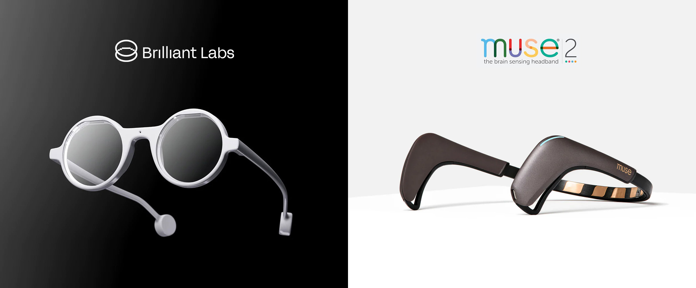

# frame-eeg

Simple integration of Muse EEG headbands with Brilliant Labs’ Frame AI glasses



This project provides real-time EEG band power (Alpha, Beta, Delta, Gamma, Theta waves) and mental state values (Relaxation, Focus, Stress, and Drowsiness) displayed directly on the Frame AI glasses using BrainFlow, with additional desktop visualization via PyQtGraph.

During streaming, users can toggle between viewing band powers and mental state estimations with a single tap on the temple of the glasses. This basic setup provides both wearable and desktop interfaces for real-time cognitive state monitoring.

## Hardware

- **Muse EEG headset**
[Link Text](https://choosemuse.com/)

- **Brilliant Labs’ Frame AI glasses**  
https://brilliant.xyz/  
https://docs.brilliant.xyz/  

Tested with Muse 2 and Muse S; theoretically compatible with any EEG device supported by BrainFlow's board-agnostic API.

## Installation

1. Clone the repository:
   ```bash
   git clone https://github.com/username/repository-name.git


